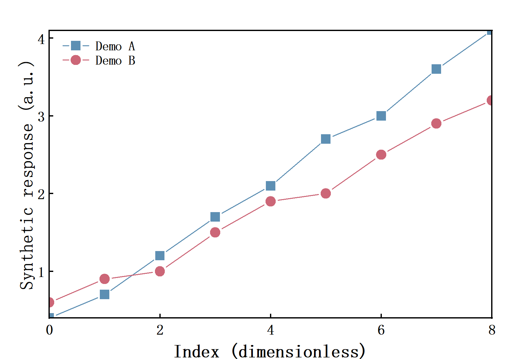

# Origin科研绘图


在Windows本机使用Codex控制Origin/OriginPro，导入和读取工作表、创建原生科研图、调整图形样式、导出预览，并保存可编辑的Origin项目。插件版本为 **0.1.2**，附可单独安装的中文Skill。

## 仓库内容

| 路径 | 内容 |
| --- | --- |
| `skills/origin-plotting/` | 独立Skill，包括`SKILL.md`和界面配置 |
| `plugins/origin-scientific-plotting/` | 完整插件，含清单、图标、内置Skill、MCP启动器及30个上游源文件/资源 |
| `.agents/plugins/marketplace.json` | 本地Codex插件市场清单 |
| `packages/origin-scientific-plotting-0.1.2.zip` | 已验证本机版本的完整插件包 |
| `examples/` | 合成演示数据生成的PNG及可编辑`.opju`，附验证记录 |
| `scripts/` | 运行环境配置、插件打包及文件清单校验脚本 |
| `docs/INSTALL.md` | 安装、迁移与验证说明 |
| `docs/PROVENANCE.md` | 来源、许可与验证边界 |

## 快速安装

需要Windows、已授权的Origin/OriginPro，以及Python环境。实际验证环境为OriginPro 2026、Python 3.10.4、MCP 1.29.1、pywin32 312和Pillow 12.3.0。

```powershell
git clone https://github.com/zychen427/origin-scientific-plotting.git
cd origin-scientific-plotting
py -3.10 -m venv .venv
& .\.venv\Scripts\python.exe -m pip install -r .\plugins\origin-scientific-plotting\server\requirements.txt
& .\.venv\Scripts\python.exe .\scripts\configure_runtime.py --python .\.venv\Scripts\python.exe
codex plugin marketplace add .
codex plugin add origin-scientific-plotting@origin-research-local
```

`py -3.10`需要本机已安装Python 3.10。如果使用其他Python版本，替换创建环境的命令并按后文验证兼容性。插件包中的`mcp.json`保留已验证机器的启动配置；另一台电脑必须先运行配置脚本，将启动命令更新为该电脑的Python绝对路径。应先配置本地检出目录，再安装插件。已经安装过的插件可再次执行`codex plugin add`同步配置；不要直接编辑插件缓存。

新建Codex聊天后检查插件和工具是否加载。浏览器或手机中保存插件包不会自动提供Windows本机的Origin进程。更多说明见[安装文档](docs/INSTALL.md)。

## 独立Skill

可单独使用[`skills/origin-plotting/SKILL.md`](skills/origin-plotting/SKILL.md)。将整个`skills/origin-plotting`目录复制到实际Codex Skill目录后，在新的聊天中检查是否发现。独立Skill提供流程与规则；Origin操作仍需要已配置的Origin MCP服务。完整插件会同时安装内置Skill和MCP配置。

## 使用示例

> 在本地Origin读取指定CSV，A列作为时间，B/C列作为浓度，核对单位后绘制双曲线，导出PNG并保存新的opju项目。

> 打开指定Origin项目的副本，检查工作表和曲线，再调整图例与坐标轴。

每次绘图先读取来源和实际列映射。误差含义、样本量、缺失数据和拟合条件缺失时不推测；科研图应回查原生对象并检查导出预览。

## 验证结果

2026-10-08从实际安装目录启动插件：MCP握手、45个工具发现、双曲线创建、1600×1134 PNG导出和可编辑`.opju`保存通过。记录见[`examples/verification.json`](examples/verification.json)。



[下载可编辑Origin演示项目](examples/origin-plugin-demo.opju)。演示数据用于验证插件，未代表实验测量。未逐项测试全部图型、拟合模型、导出格式或期刊排版要求；演示预览不是特定期刊投稿图版。API返回成功后仍应检查Origin实际渲染。

## 重新打包与校验

```powershell
python .\scripts\package_plugin.py
python .\scripts\verify_distribution.py
```

重新打包会包含当前配置的Python路径，并同步独立Skill与插件内置Skill，更新SHA-256清单。修改运行环境后可以重新打包自己的安装副本。

## 来源与许可

本仓库自有内容采用[MIT许可证](LICENSE)。Origin控制实现来自[youngminsw/Origin-Pro-MCP](https://github.com/youngminsw/Origin-Pro-MCP)，其[原始MIT声明](plugins/origin-scientific-plotting/server/LICENSE)完整保留。准确来源提交及全部源文件的SHA-256见[来源说明](docs/PROVENANCE.md)和[`server/PROVENANCE.json`](plugins/origin-scientific-plotting/server/PROVENANCE.json)。
